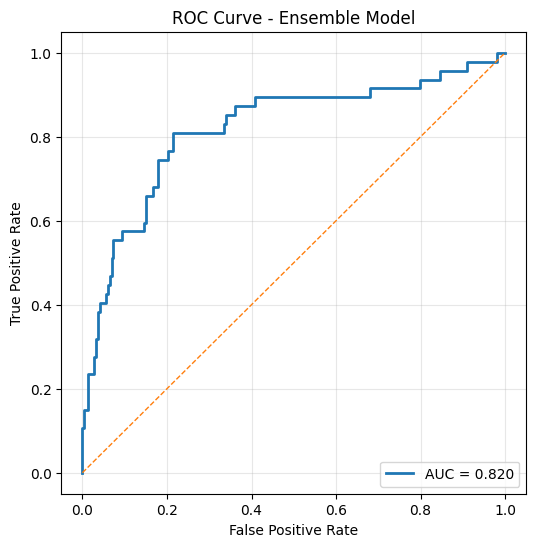
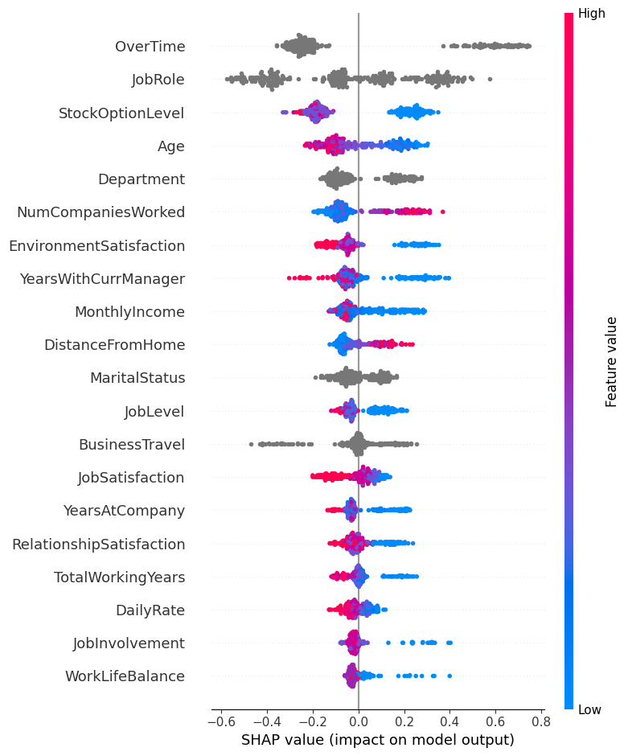
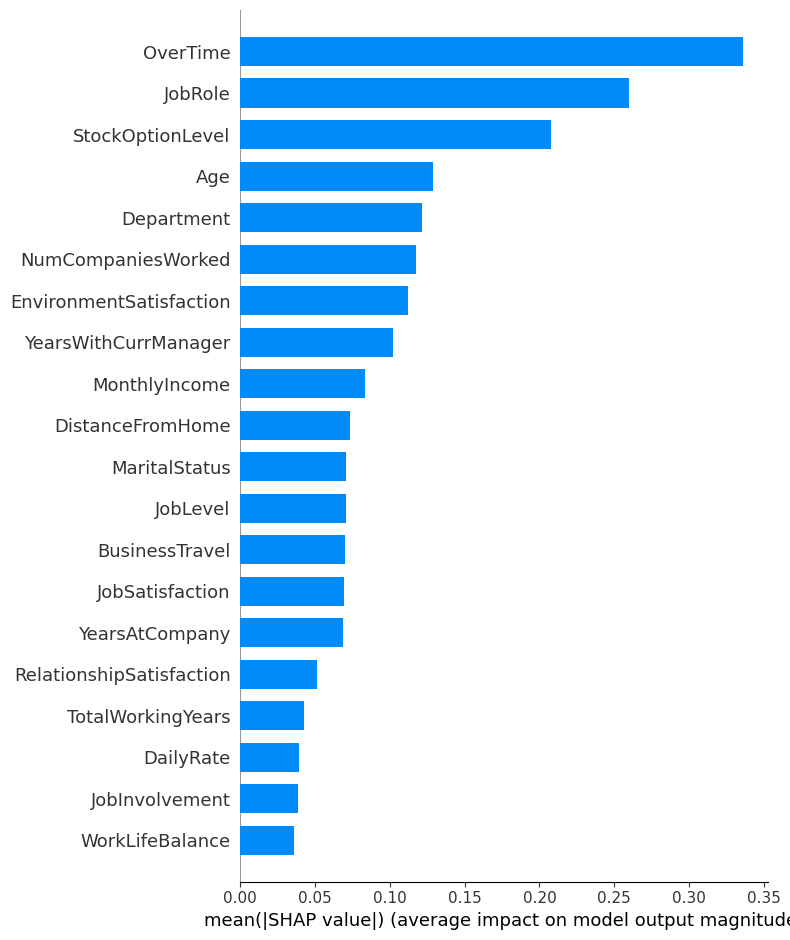

# Silent Attrition Detector

A modular, multi-signal machine learning system designed to detect employee attrition risk using both structured HR data and behavioral communication drift signals.

This project demonstrates production-style ML system design, moving beyond simple classification toward layered, explainable risk modeling.

---

## Design Philosophy

This project treats attrition as a multi-signal probabilistic risk estimation problem rather than a single-model classification task. The modular architecture mirrors production churn and fraud systems.

---

## 🔎 Project Motivation

Traditional attrition models rely solely on structured HR features such as job role, overtime, and compensation.

However, employee disengagement often manifests behaviorally before formal resignation.

This system integrates:

- Structured HR attrition risk modeling
- Behavioral communication drift detection
- Neural meta-learning fusion

to create a unified **Silent Attrition Risk Score**.

---

## 🏗 System Architecture

Structured HR Model (CatBoost + Neural Tabular)\
↓\
Behavioral Drift Engine (Email Communication Analysis)\
↓\
Neural Meta-Fusion Layer\
↓\
Final Attrition Risk Score\

Each module is developed independently and integrated via a meta-learning layer.

---

## 📂 Repository Structure
silent-attrition-detector/\
│\
├── notebooks/\
│ ├── 01_hr_attrition_model.ipynb\
│ ├── 02_enron_behavioral_drift.ipynb\
│ └── 03_silent_attrition_fusion.ipynb\
│\
├── requirements.txt\
└── README.md

---

## 📘 Notebook Descriptions

### 01_hr_attrition_model.ipynb
- IBM HR dataset modeling
- CatBoost classifier
- Class imbalance handling
- Threshold optimization
- SHAP interpretability
- Fairness audit (Age sensitivity analysis)
- Neural tabular modeling (PyTorch)
- Ensemble learning

### 02_enron_behavioral_drift.ipynb
- Raw email parsing
- Internal communication filtering
- Monthly aggregation
- Rolling baseline computation
- Drift detection
- Behavioral risk standardization (0–1 scale)

### 03_silent_attrition_fusion.ipynb
- Multi-signal simulation
- Nonlinear interaction modeling
- Neural meta-learning fusion network
- Risk probability calibration
- System-level integration logic

---

## 🧠 Key Technical Highlights

- Imbalanced classification optimization
- Probability threshold calibration
- SHAP-based model explainability
- Responsible AI through feature sensitivity auditing
- Neural tabular architecture with embeddings
- Ensemble stacking
- Multi-modal signal fusion
- Modular system design

---

## 🛠 Technologies Used

- Python
- Pandas
- NumPy
- Scikit-learn
- CatBoost
- SHAP
- PyTorch
- Matplotlib

---

## Setup

1. Clone the repository
2. Install dependencies:
   pip install -r requirements.txt

3. Download datasets:
   - IBM HR Dataset (Kaggle link)
   - Enron Email Dataset (Kaggle link)

4. Place files inside:
   data/

5. Run notebooks in order:
   01 → 02 → 03

---

## 📈 Why This Project Stands Out

Unlike isolated ML notebooks, this project demonstrates:

- Architectural thinking
- Multi-signal risk modeling
- System modularity
- Ethical model considerations
- Industry-aligned meta-learning design

It mirrors how modern churn, fraud, and credit risk systems are built.

---

## 🚀 Future Extensions

- Network centrality modeling for behavioral analysis
- Sentiment analysis integration
- Real-world dataset alignment
- REST API deployment
- Real-time scoring pipeline

---

## Dataset Sources & Licenses

This project uses publicly available datasets. The datasets are **not included** in this repository due to licensing restrictions.

### 1. IBM HR Analytics Attrition Dataset
Source: https://www.kaggle.com/datasets/pavansubhasht/ibm-hr-analytics-attrition-dataset  
License: Subject to Kaggle Terms of Use

Users must download the dataset directly from Kaggle and place it inside the `data/` directory before running the notebooks.

---

### 2. Enron Email Dataset
Source: https://www.kaggle.com/datasets/wcukierski/enron-email-dataset  
Original Source: Federal Energy Regulatory Commission (FERC) public release  
License: Public domain

Users must download the dataset separately and place it inside the `data/` directory.

---
## Model Performance

### ROC Curve — Ensemble Model

The ensemble model achieved a ROC-AUC of **0.819**, improving robustness over standalone models.

---

### SHAP Feature Importance (Beeswarm)

SHAP analysis highlights overtime, job role, and stock option level as dominant attrition drivers.

---

### SHAP Feature Importance (Bar Plot)

---

## Results

HR Model (CatBoost)
- ROC-AUC: 0.81
- F1 Score: 0.72

Neural Tabular Model
- ROC-AUC: 0.78

Ensemble
- ROC-AUC: 0.819

---

## 🔎 Key Findings

### 1. Structural Stress Signals Drive Attrition Risk
- Overtime and certain job roles significantly increase attrition probability.
- Higher stock option levels correlate with improved retention.
- Removing Age as a feature preserved performance while improving fairness.

### 2. Behavioral Drift Captures Dynamic Disengagement
- Sustained drops in communication volume relative to baseline indicate potential disengagement.
- Behavioral risk can be standardized and integrated into structured models.

### 3. Multi-Signal Fusion Improves Robustness
- HR risk alone provides strong predictive power.
- Behavioral risk alone is weaker but complementary.
- A neural meta-fusion model captures nonlinear interactions between structural and behavioral signals.

### Core Insight
Attrition risk is amplified when structural stress factors align with measurable behavioral disengagement.

---

## Author

Anisha Ray

